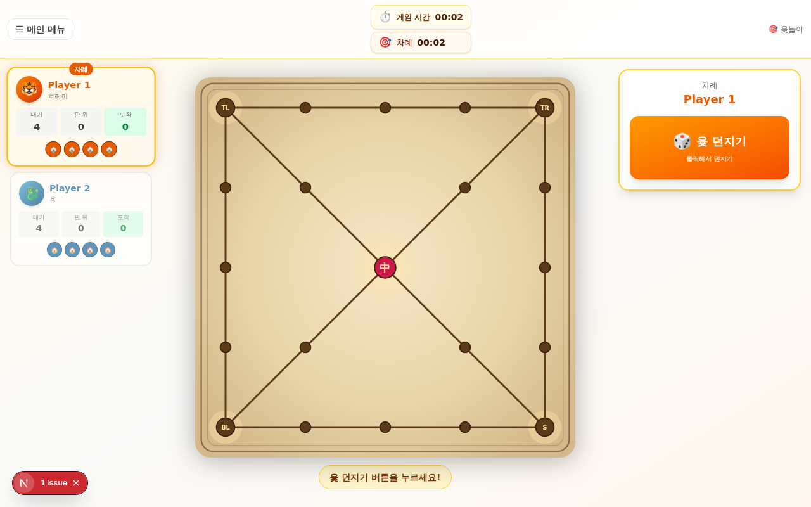

# Yut Nori - Korean Traditional Board Game with 3D Physics

A web-based implementation of **Yut Nori** (윷놀이), a classic Korean board game, featuring stunning 3D graphics with realistic physics simulation.



## Overview

Yut Nori is a traditional Korean board game played with four wooden sticks. This project recreates the authentic game experience in the browser with:

- **Realistic 3D Physics**: Physics-based stick throwing and piece movement using Rapier 3D
- **Interactive Gameplay**: Support for 2-4 players
- **Responsive Design**: Works seamlessly on desktop and mobile devices
- **Beautiful Visuals**: Three.js-powered 3D rendering with smooth animations
- **Static Deployment**: Fully static site deployable to GitHub Pages

## Features

- 🎲 **Authentic Yut Nori Rules**: Traditional game mechanics with special moves
- 🎮 **Multi-player Support**: Play with 2-4 players
- 📱 **Mobile Friendly**: Touch controls and responsive layout
- 🌐 **Internationalization**: Multi-language support with next-intl
- 🎨 **Dark/Light Mode**: Theme switcher with next-themes
- 🔒 **Persistent State**: Game state saved to localStorage
- 📊 **Game Statistics**: Track game progress and scores

## Tech Stack

### Core Framework
- **Next.js 16.1** - React framework with TypeScript
- **React 19** - UI library
- **TypeScript** - Type-safe development

### 3D & Physics
- **Three.js** - 3D graphics library
- **React Three Fiber** - React renderer for Three.js
- **Rapier 3D** - Physics engine with WebAssembly
- **React Three Rapier** - React bindings for Rapier

### Styling & UI
- **Tailwind CSS 4** - Utility-first CSS framework
- **shadcn/ui** - High-quality React components
- **Framer Motion** - Animation library
- **Lucide React** - Icon library

### State & Data
- **Zustand** - State management
- **TanStack Query** - Data fetching and caching
- **Prisma** - Database ORM
- **React Hook Form** - Form management with Zod validation

### Other Tools
- **next-auth** - Authentication
- **next-intl** - Internationalization
- **Embla Carousel** - Carousel component
- **Sonner** - Toast notifications

## Getting Started

### Prerequisites
- Node.js 18+
- Bun (recommended) or npm

### Installation

```bash
# Clone the repository
git clone https://github.com/CJ-1981/yut-nori.git
cd yut-nori

# Install dependencies
bun install
# or
npm install
```

### Development

```bash
# Start development server
bun run dev
# or
npm run dev
```

Open [http://localhost:3000](http://localhost:3000) to play the game.

### Production Build

```bash
# Build for production (Node.js standalone)
bun run build

# Start production server
bun run start
```

## Deployment

### GitHub Pages (Recommended)

This project includes a GitHub Actions workflow for automated deployment to GitHub Pages as a fully static site.

**Setup:**
1. Go to your repository **Settings → Pages → Build and deployment**
2. Select **GitHub Actions** as the source
3. Push to `main` branch
4. The deployment workflow runs automatically

**Local testing:**
```bash
GITHUB_REPOSITORY=user/repo DEPLOY_TARGET=gh-pages npm run build:gh-pages
npm run serve:gh-pages
```

For detailed deployment instructions, see [GH-PAGES-DEPLOY.md](GH-PAGES-DEPLOY.md).

### Other Platforms

The default build creates a standalone Node.js server bundle compatible with:
- Vercel
- Render
- Railway
- Fly.io
- Self-hosted servers

## Project Structure

```
yut-nori/
├── src/              # Application source code
│   ├── app/          # Next.js app directory
│   ├── components/   # React components
│   ├── lib/          # Utility functions and helpers
│   └── styles/       # Global styles
├── public/           # Static assets and WASM files
├── prisma/           # Database schema and migrations
├── tests/            # Test files
├── scripts/          # Build and utility scripts
└── next.config.ts    # Next.js configuration
```

## Game Rules

**Yut Nori** is played with four wooden sticks:

1. **Throwing**: Players throw the yut sticks to determine moves (do=1, gae=2, geol=3, yut=4, mo=5)
2. **Moving Pieces**: Move game pieces around the board based on the throw result
3. **Shortcuts**: Land on special spots to take shortcuts
4. **Capturing**: Capture opponent pieces to send them back home
5. **Winning**: First to move all pieces around the board and home wins

## Scripts

```bash
# Development
bun run dev              # Start dev server

# Building
bun run build            # Build for production
bun run build:gh-pages   # Build for GitHub Pages

# Deployment
bun run serve:gh-pages   # Serve GitHub Pages build locally

# Database
bun run db:push          # Push schema to database
bun run db:generate      # Generate Prisma client
bun run db:migrate       # Run database migrations
bun run db:reset         # Reset database

# Linting
bun run lint             # Run ESLint
```

## Browser Support

- Chrome/Edge (latest)
- Firefox (latest)
- Safari (latest)
- Mobile browsers (iOS Safari, Chrome Mobile)

**Requirements:**
- WebGL support for 3D graphics
- WebAssembly support for physics engine

## Performance

The physics engine (Rapier WASM) is approximately 1.4 MB and lazy-loads on first stick throw. This ensures:
- Fast initial page load
- Smooth gameplay once loaded
- Efficient memory usage

## Contributing

Contributions are welcome! Please:

1. Fork the repository
2. Create a feature branch (`git checkout -b feature/amazing-feature`)
3. Commit your changes (`git commit -m 'Add amazing feature'`)
4. Push to the branch (`git push origin feature/amazing-feature`)
5. Open a Pull Request

## License

This project is open source and available under the MIT License.

## Troubleshooting

### Build Issues
If you encounter build errors, try:
```bash
rm -rf node_modules bun.lock
bun install
bun run build
```

### Physics Not Loading
Ensure the WASM file is properly copied to `public/`:
```bash
bun run build  # This copies the WASM file automatically
```

### Mobile Issues
- Clear browser cache
- Try a different mobile browser
- Check that WebGL is enabled

## Credits

Built with ❤️ by CJ-1981

### References
- [Next.js Documentation](https://nextjs.org/docs)
- [Three.js Documentation](https://threejs.org/docs)
- [Rapier Physics Engine](https://www.rapier.rs/)
- [Yut Nori Wikipedia](https://en.wikipedia.org/wiki/Yut)

## Support

For issues, questions, or suggestions:
- Open an [Issue](https://github.com/CJ-1981/yut-nori/issues)
- Check existing [Discussions](https://github.com/CJ-1981/yut-nori/discussions)

---

**Play Yut Nori Online**: [https://cj-1981.github.io/yut-nori/](https://cj-1981.github.io/yut-nori/)
